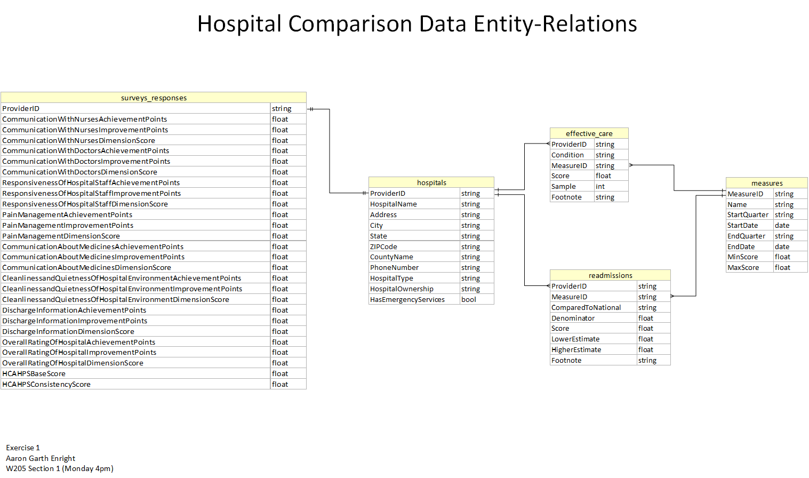

# MIDS W205 : Exercise 1
Aaron Garth Enright
W205 Section 1 (Monday 4pm)

## Introduction

Exercise 1 take a large dataset and loads it into Hadoop to answer some questions about the data.  The dataset was taken by the Center for Medicare and Medicaid Services (CMS) in 2015 and is
related to hospital quality care.

The questions that we were asked were:

- What hospitals are models of high-quality care? That is, which hospitals have the most consistently high scores for a variety of procedures.
- What states are models of high-quality care?
- Which procedures have the greatest variability between hospitals?
- Are average scores for hospital quality or procedural variability correlated with patient survey responses?

## Platform

We performed this exercise using Hadoop 2.6 and Apache Spark 1.5 on linux (Centos 6.6).  The VM configuration was based on the UCB W205 Spring 2016 image.  Our particular instance was configured as:

| Family          | Type     | VCPUs | Memory (GiB) | Instance Storage | EBS Optimized Available | Network Performance | IPv6 Support |
| --------------- | -------- | ----- | ------------ | ---------------- | ----------------------- | ------------------- | ------------ |
| General Purpose | m1.large | 2     | 7.5          | 2x420            | Yes                     | Moderate           | No            |

## Methodology

### Week 1

In this week, we loaded the CSV files from the CDC directly into Hadoop for general purpose viewing and data exploration.  It was here that we identified the following issues that would need to be
corrected/transformed in the data:

- Several tables had "pseudo" foreign keys into other tables.  What we mean here is that they had fields labelled with the same name as another table, but no entry in that other table.  In all
cases, we were able to locate the correct data using denormalized fields in each CSV.
- Many data were of a type not useful for comparison/manipulation.  For example, survey responses were noted as "0 out of 9" for example.
- Data was highly denormalized.
	
So, exploring this data and looking at the questions asked, we derived the following ERD:

Our loading and modelling files are included in the sub-folder [loading_and_modelling](loading_and_modelling)

### Week 2

This week, we transformed the data using pyspark.  Our transformations included the following:

- Normalizing the data.  Much of the data was denormalized in the original files, adding confusion and to possible errors.  We determined the correct table for each field and ensured that there
was only one copy of each one.
- Fixing foreign key references.  Especially important with the step above was ensuring that all foreign key references were correct.  Our findings from Week 1 (above) was that the measures table -
the table that included the metrics being used to compare tables had inconsistent capitlization with the effective_care and readmissions tables.  The effective_care table also referenced a measure called
IMM_3_FAC_ADHPCT which occurred nowhere in the measures table;  we found that there was a key called IMM_3 which had no reference in the effective_care table, and seemed to correspond data-wise, so we
changed all references in effective_care to IMM_3.  There was also a ProviderID in the surveys_responses table that did not exist in the hospitals table;  however, we matched HopitalName, Address, City, State,
ZipCode, and CountyName in the denormalized data back to another ProviderID and substituted it.
- Converting to native types.  There were several cases of data that was obviously intended to be a type other than string.  This included dates in the measures table, a flag to indicate whether a
hospital had emergency services, Scores and sample-sizes in the effective_care and readmissions tables, and HCAHPS scores in the surveys_responses table.  In the cases where data was marked "Not Available",
we generally inserted null into the final tables.
- Tranforming the data to enable comparisons.  Here we needed to convert values such as "0 out of 9" into usable numerics for comparison.  This required a complex UDF, which exhausted our system
resources.  The only workaround we found was to break the surveys_results table into three temporary tables and tranform each in turn then re-join the table.  Within the effective care table were also
Scores that were both categorical and numeric, so we changed all scores to numerics for final processing.  We also add an indicator variable to readmissions to ensure quick comparison to the national average.
- Creating ranges on the measures.  Many of the measures had different ranges in the effective_care and readmissions tables, so in hopes fo being able to normalize these data, we enriched the
metrics table with a MinScore and MaxScore for each category that appeared in one of the other tables.
- Creating appropriate data checks on the transformations.  We perform automated row count checking and foreign key validation.  For actual data validation, we'll perform ad-hoc queries.

Our transformation file is in the sub-folder [transforming](transforming)

### Week 3

In the final week, we use the transformed data to answer the questions.

#### First Question: What hospitals are models of high-quality care? That is, which hospitals have the most consistently high scores for a variety of procedures.

We incorporated all the procedure metrics, and normalized them (that is put them on a percentage
scale, based on the range of the survey data). However, we felt that we needed to incorporate the
readmissions and death data into the score.  To do this, we found the number of "Better than
National Average" marks for each hospital and added a bonus multiplier to the score and subtracted
"Worse than National Average Marks".  This bonus became a multiplier for the hopital rank to try
and balance procedural metrics against a very important set of data.  The resulting list is given below:

| -------------------------------------------------- | ---------------------- | ----------------- | ----- | ------- | --------------------- | ------------------------ | ------------------- |
| HospitalName                                       | Address                | City              | State | ZIPCode | ConditionScoreAverage | ReAdmissionAndDeathScore | FinalScore          |
| -------------------------------------------------- | ---------------------- | ----------------- | ----- | ------- | --------------------- | ------------------------ | ------------------- |
| SARASOTA MEMORIAL HOSPITAL                         | 1700 S TAMIAMI TRL     | SARASOTA          | FL    | 34239   | 0.7265794562085376    | 0.5714285714285714       | 0.4151882606905929  |
| MEMORIAL HERMANN HOSPITAL SYSTEM                   | 1635  NORTH LOOP WEST  | HOUSTON           | TX    | 77008   | 0.7343301230665824    | 0.42857142857142855      | 0.3147129098856782  |
| EVANSTON HOSPITAL                                  | 2650 RIDGE AVE         | EVANSTON          | IL    | 60201   | 0.6950438882412874    | 0.42857142857142855      | 0.29787595210340884 |
| WILLIS KNIGHTON MEDICAL CENTER                     | 2600 GREENWOOD ROAD    | SHREVEPORT        | LA    | 71103   | 0.6863969373370338    | 0.42857142857142855      | 0.2941701160015859  |
| BAYSTATE MEDICAL CENTER                            | 759 CHESTNUT STREET    | SPRINGFIELD       | MA    | 01199   | 0.7308459266688198    | 0.35714285714285715      | 0.26101640238172136 |
| MEMORIAL MISSION HOSPITAL AND ASHEVILLE SURGERY CE | 509 BILTMORE AVE       | ASHEVILLE         | NC    | 28801   | 0.7210793949631527    | 0.35714285714285715      | 0.2575283553439831  |
| ALEXIAN BROTHERS MEDICAL CENTER 1                  | 800 W BIESTERFIELD RD  | ELK GROVE VILLAGE | IL    | 60007   | 0.6794264685204503    | 0.35714285714285715      | 0.2426523101858751  |
| EISENHOWER MEDICAL CENTER                          | 39-000 BOB HOPE DRIVE  | RANCHO MIRAGE     | CA    | 92270   | 0.7206220060326444    | 0.2857142857142857       | 0.20589200172361266 |
| CEDARS-SINAI MEDICAL CENTER                        | 8700 BEVERLY BLVD      | LOS ANGELES       | CA    | 90048   | 0.7104983289236992    | 0.2857142857142857       | 0.20299952254962833 |
| JOHN MUIR MEDICAL CENTER - WALNUT CREEK CAMPUS     | 1601 YGNACIO VALLEY RD | WALNUT CREEK      | CA    | 94598   | 0.7088908622565122    | 0.2857142857142857       | 0.20254024635900347 |
| -------------------------------------------------- | ---------------------- | ----------------- | ----- | ------- | --------------------- | ------------------------ | ------------------- |

Code and results can be found in: [investigations/best_hospitals](investigations/best_hospitals)

#### Second Question:  What states are models of high-quality care?

We treated this as a variation of the first question, but grouped the data by the hospitals'
state.  Results are below:

| ----- | --------------------- | ------------------------ | ------------------- |
| State | ConditionScoreAverage | ReAdmissionAndDeathScore | FinalScore          |
| ----- | --------------------- | ------------------------ | ------------------- |
| DE    | 0.680023554613072     | 0.02040816326530612      | 0.35021585893918905 |
| NJ    | 0.6617723332507028    | -0.024175824175824177    | 0.3187982545374393  |
| CT    | 0.6020335210635446    | 0.013824884792626729     | 0.3079292029280857  |
| RI    | 0.6196759555670457    | -0.005952380952380952    | 0.3068617873073324  |
| MA    | 0.5805611659627714    | 0.020879120879120878     | 0.30072014342094616 |
| FL    | 0.5962207806059759    | -0.023425499231950846    | 0.28639764068701257 |
| CA    | 0.5573465511636649    | 0.00835421888053467      | 0.2828503850220998  |
| SC    | 0.5453842200795497    | -0.0045351473922902496   | 0.27042453634362973 |
| NC    | 0.545566839306083     | -0.009652509652509652    | 0.26795716482678666 |
| PA    | 0.5401853448084121    | -0.006229235880398671    | 0.2669780544640067  |
| ----- | --------------------- | ------------------------ | ------------------- |

Code and results can be found in: [investigations/best_states](investigations/best_states)

#### Third Question:  Which procedures have the greatest variability between hospitals?

We looked for high variability in the metrics by finding the mean and standard deviation of the
sample of procedure (in the effective care data), then looked for results with a large average
number of standard deviations away from the mean.  The top 10 items are listed below:

| ------------------------------------------------------------------------------------------------------------------------------------------------------------- | --------------------- | ---------------------- | ------------------- |
| Name                                                                                                                                                          | ScoreAverage          | ScoreStandardDeviation | Variability         |
| ------------------------------------------------------------------------------------------------------------------------------------------------------------- | --------------------- | ---------------------- | ------------------- |
| Aspirin Prescribed at Discharge                                                                                                                               | 0.4676739690721657    | 0.49334403774660446    | 0.9974000793322696  |
| Aspirin at Arrival                                                                                                                                            | 0.49028946728290457   | 0.4842554302288592     | 0.99694475119496    |
| Statin Prescribed at Discharge                                                                                                                                | 0.4586168384879751    | 0.48860021949759497    | 0.9954116214449141  |
| Venous Thromboembolism Patients Receiving Unfractionated Heparin with Dosages/Platelet Count Monitoring by Protocol or Nomogram                               | 0.4339819587628876    | 0.49177290216458586    | 0.9908769545720522  |
| Discharged on Antithrombotic Therapy                                                                                                                          | 0.5660674398625414    | 0.48844876282520633    | 0.987372549309221   |
| Antithrombotic Therapy By End of Hospital Day 2                                                                                                               | 0.5616967353951875    | 0.4850840425178857     | 0.9871621682472559  |
| Discharged on Statin Medication                                                                                                                               | 0.5205111683848813    | 0.47245519783849815    | 0.9858287403753931  |
| Stroke Education                                                                                                                                              | 0.46125429553265074   | 0.463537003798493      | 0.9848703820782595  |
| Assessed for Rehabilitation                                                                                                                                   | 0.5641666666666648    | 0.4817030138249755     | 0.9842916202914996  |
| ACEI or ARB for LVSD                                                                                                                                          | 0.5577920962199308    | 0.47896323249479267    | 0.983542639514377   |
| ------------------------------------------------------------------------------------------------------------------------------------------------------------- | --------------------- | ---------------------- | ------------------- |

The code and complete list of results are in [investigations/hospital_variability](investigations/hospital_variability)

#### Fourth Question:  Are average scores for hospital quality or procedural variability correlated with patient survey responses?

Our response to this question is no.  We ran our hospitals rating against the overall survey
responses and we found a weak, negative correlation of -0.280270124681.
This is not surprising to us, as what may be important to survey respondents may not be related
in any way to the measures that would be taken by health care professionals. 

The code and a complete write up can be found in [invetigations/hospitals_and_patients](investigations/hospitals_and_patients)

# Conclusions

We were able to load and run a study on a large data set using Hadoop and apache spark.  Most of
the work was done in Pyspark, but some was also done in Hive and Apache SQL.  We were able to
devise a ranking system for hospitals and states, find variability in the metrics, and determined
that patient surveys were not a good predictor of hospital performance.
